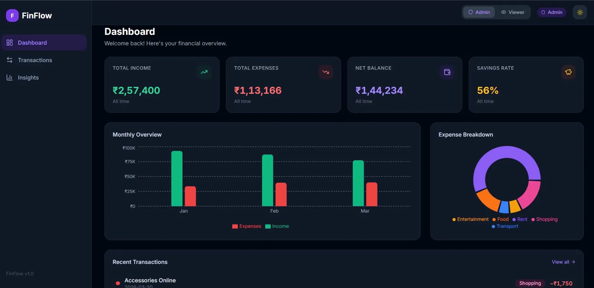
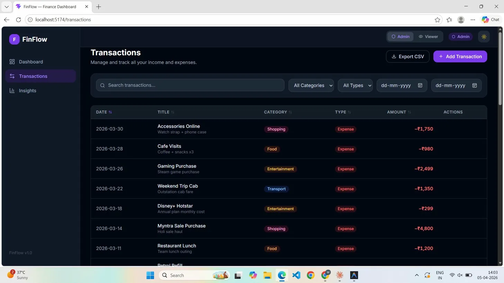
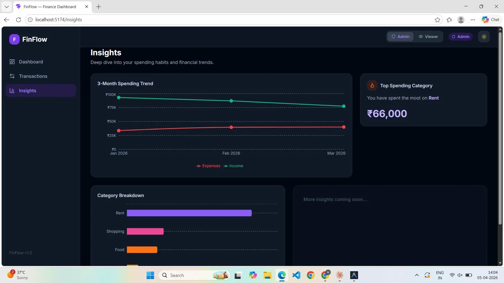

# 💰 FinFlow

**FinFlow** is a modern, responsive, role-based finance dashboard. It empowers users to track income and expenses, monitor savings, and visualize their financial health through beautiful, interactive charts.

[](https://finflow-demo-placeholder.vercel.app)
> *Note: Live demo is a placeholder.*

---

## 🎨 Screenshots

> **Dashboard View:** Shows summary cards with animated counters, monthly spending chart, and category pie chart.

> **Transactions View:** Features a full data table, CSV export, multi-field filtering, and the add/edit modal.

> **Insights View:** visualizes a 3-month spending trend, category breakdown, and monthly savings comparison.

---

## ✨ Key Features

- **Role-Based Access Control (RBAC):** Native toggle between *Admin* (full CRUD abilities) and *Viewer* (read-only) modes.
- **Dynamic Visualizations:** Interactive donut charts, grouped bar charts, and trend line charts.
- **Advanced Filtering & Sorting:** Search transactions by title, filter by date ranges, category, type (income vs. expense), and sort by any table column.
- **Data Export:** Instantly export filtered transaction views directly to CSV.
- **Smart Data Persistence:** Utilizes local storage state persistence so your settings (dark mode, role) and transactions survive page reloads.
- **Dark Mode Support:** First-class dark mode tailored with custom styling and a sleek glass-morphism aesthetic.
- **Micro-interactions:** Animated number counters, smooth hover states, and dynamic tooltips.

---

## 🛠️ Tech Stack & Philosophy

Every tool in this stack was deliberately chosen to prioritize performance, maintainability, and developer experience.

| Technology | Why was it chosen? |
| :--- | :--- |
| **React 18 + Vite** | Provides a blazing-fast development environment (HMR) and a highly optimized production build compared to Create React App. |
| **Tailwind CSS v3** | Enables rapid, utility-first styling without context-switching. Allowed us to easily orchestrate custom tokens for dark mode and global animations. |
| **Zustand** | Chosen over Redux/Context for its elegant, boilerplate-free state management. Perfectly handles our mocked database, RBAC state, and local-storage persistence cleanly. |
| **Recharts** | A highly customizable charting library built natively for React components. Makes rendering SVG charts responsive and beautiful. |
| **React Router v6** | The gold standard for declarative routing. Handles our nested layout shell cleanly while avoiding page refreshes across the Dashboard, Transactions, and Insights views. |
| **PapaParse** | The fastest in-browser CSV parser. Enables a seamless client-side CSV export of data without needing a backend. |

---

## 🏛️ Design Decisions

### Component Architecture
The component tree strictly adheres to atomic-like principles to guarantee reusability:
1. **Layouts (`/layout`)**: Contains structural components (`Navbar`, `Sidebar`, `Layout`) that manage navigation and responsiveness (collapsing sidebars on mobile).
2. **UI Primitives (`/ui`)**: Highly reusable, generic components (`Button`, `Card`, `Modal`, `Badge`) that form the foundation of the design system. They accept generic props like `variant` or `size`.
3. **Feature Components (`/dashboard`, `/transactions`, `/insights`)**: Domain-specific components that piece together primitives and connect to the Zustand store (e.g., `SpendingChart`, `TransactionTable`).

### State Management Approach
State is kept out of local component memory unless it is strictly UI logic (e.g., modal open/close states).
- **Zustand Context:** A global `useFinanceStore` operates as the single source of truth for `transactions`, the current `role`, and `darkMode`. 
- **Derived State Hook:** Advanced filtering is executed cleanly via a custom `useFilteredTransactions` hook which memoizes (`useMemo`) the filtered array based on active criteria securely without mutating the base data store.

### Role-Based UI
Security through UX mapping. By switching between **Admin** and **Viewer**:
- Admins see the "+ Add Transaction" CTA and row-level Edit/Delete actionable icons.
- Viewers have the exact same analytical experience and data access but with data-mutation entry points structurally omitted from the DOM.

---

## 🚀 Setup Instructions

Follow these steps to get the project running locally on your machine.

**1. Clone the repository**
```bash
git clone https://github.com/yourusername/finance-dashboard.git
cd finance-dashboard
```

**2. Install dependencies**
```bash
npm install
```

**3. Run the development server**
```bash
npm run dev
```

**4. Open the App**
Open `http://localhost:5173` in your browser. The app runs completely via client-side routing and local storage. No backend setup is required.

---

## 📄 License
This project is open source and available under the [MIT License](LICENSE).
